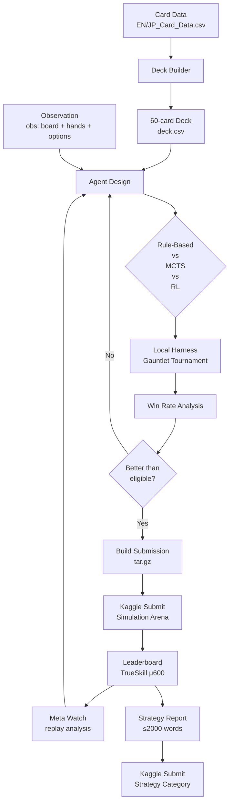

# Iteration Workflow

A structured workflow for developing, testing, and comparing AI agents for the
[Pokemon TCG AI Battle Challenge](https://www.kaggle.com/competitions/pokemon-tcg-ai-battle).

---

## Quick Start

```bash
make install          # dependencies + kaggle auth (one-time)
make download         # card reference data (one-time)
make sim-download     # simulation SDK (one-time — join both competitions first)

# Run your first experiment
mkdir -p workspace/exp001_baseline
# ... write agent.py and deck.csv ...
make gauntlet

# Compare experiments
ls workspace/results/*.json
```

---

## Visual Walkthrough



Each experiment is a self-contained directory under `workspace/expNNN_name/` with its own `agent.py`, `deck.csv`, and `SESSION_NOTES.md`.

---

## How It Works

### 1. Agent-driven experiments

Every experiment is a self-contained agent directory:

```
workspace/exp001_baseline/
  agent.py              # Agent subclass (RuleBasedAgent, MCTSAgent, etc.)
  deck.csv              # 60 Card IDs
  SESSION_NOTES.md      # Hypothesis, changes, results, takeaways
```

### 2. Local gauntlet testing

```bash
make gauntlet
```

Runs a round-robin tournament between all registered agents (random baseline + your experiments). Each pairing plays `n_matches` games with first/second player swapped.

```
workspace/results/
  gauntlet_results.json   # win-rate per agent
  exp001_vs_exp002.json   # head-to-head records
```

### 3. Live leaderboard tracking

Agents are rated via TrueSkill (μ/σ, μ₀=600). Only the **latest 2 submissions** count. This means:

- Submitting a worse agent can **displace** a better one from evaluation.
- Always test locally before pushing to Kaggle.
- Keep your best 2 agents in the sliding window.

### 4. Meta analysis

```bash
# Check what the top players are doing
# (manual: explore Kaggle leaderboard replays)
```

Understanding the current meta (what decks and strategies top players use) is
critical — the arena evolves weekly.

---

## Domain: Pokemon TCG Game State

The agent receives an observation dict at each decision point:

| Section | Key fields | What it provides |
|---|---|---|
| **Board** | `board` (active/bench pokemon, HP, status, energy) | Complete board state for both players |
| **Hand** | `hand` (cards in hand) | Known cards the agent holds |
| **Deck** | `deck` (remaining cards) | What's left to draw |
| **Prizes** | `prizes`, `prizes_left` | Win condition progress |
| **Options** | `options`, `minCount`, `maxCount` | Available actions (attack, retreat, play card, ability, etc.) |
| **Search** | `search_begin`, `search_step`, `search_end` | Forward lookahead API (predict opponent hidden info) |

**Key insight:** The observation includes both known info (your hand, public board state) and
game-engine search. An agent succeeds by making good decisions under uncertainty (opponent's
hand, draw order, coin flips) and by building a deck that covers common threats.

### Deck construction principles

- **60 cards exactly** (Kaggle enforces this, see `EN_Card_Data.csv` for valid IDs)
- Core consideration: consistency (Pokemon/trainer/energy ratio)
- Card data fields: HP, Type, Weakness, Resistance, Retreat cost, Move costs/damage/effects
- Deck must pass `make build-submit` validation

---

## Running the Baseline

```bash
make gauntlet  # uses registered agents; add yours to scripts/gauntlet.py
```

| Setting | Value |
|---|---|
| Baseline agent | RandomAgent (randomly picks valid actions) |
| Baseline deck | Placeholder (60x Card ID 1) |
| Engine | `cg` game engine from `data/sim_sample/cg/` |
| Matches per pair | 20 (doubled for both sides) |

---

## Iteration Log

*(No experiments have been run yet. Add entries here after each run using the format below.)*

### exp001 — Rule-based heuristic baseline

**Hypothesis:** Domain-specific heuristics (attack when lethal, retreat when threatened,
manage energy efficiently) should handily beat random play.

**Change:** Implemented a rule-based agent in `workspace/exp001_rule_based/agent.py`
subclassing `RuleBasedAgent` with:
- Attack priority: lethal check → damage max → energy acceleration → bench attack
- Retreat logic: retreat if active pokemon HP < 30 and bench has healthy alternative
- Energy: attach energy to active pokemon if it has an attack that matches
- Deck: simple consistent deck from `workspace/exp001_rule_based/deck.csv`

```
run:    exp001_rule_based
wr:     TBD  vs random
wr:     TBD  vs exp002
matches: TBD
```

**Takeaway:** TBD

---

### exp002 — Lucario state-aware heuristic (Phase 1)

**Hypothesis:** A state-aware rule-based agent that parses the full `cg`
observation (board, energies, options) and applies Pokemon TCG heuristics
(lethal check, weakness x2, retreat, energy attachment, evolution) should beat
all 4 official sample decks played by a neutral baseline.

**Change:** Built the Phase 1 foundation from the experimentation strategy:
- `src/pokemon/state.py` — parses raw `cg` obs into `GameState` (me/opp
  oriented, `SelectInfo`/`OptionInfo`, combat helpers `can_pay_cost` /
  `weakness_multiplier` / `effective_damage`).
- `src/pokemon/card_db.py` — `CardDB` (engine `all_card_data`/`all_attack`
  with CSV fallback), `CardInfo`/`AttackInfo`, `validate_deck` (4-copy-by-name,
  1 ACE SPEC).
- `workspace/exp002_lucario_heuristic/agent.py` — `LucarioHeuristicAgent`
  handling every select type with safe fallbacks (never forfeits).
- `scripts/run_sample_deck_gauntlet.py` — 4-sample-deck gauntlet runner
  (decks defined in code; Abomasnow verbatim, Lucario/Dragapult/Iono
  reconstructed and engine-validated).
- Also fixed the base `RuleBasedAgent` to respect `minCount`/`maxCount` (the
  old first-option picker forfeited on multi-select prompts) and
  `build_submission.py` to bundle the `pokemon` package + a Kaggle `agent`
  entry point.

Deck: Mega Lucario ex (Riolu 677 x4, Mega Lucario ex 678 x4, Mega Signal 1145
x4, Maximum Belt 1158 x1, Cyrano 1205 x2, Lillie's Determination 1227 x4,
Waitress 1235 x4, Fighting energy 6 x37). Engine-validated.

```
run:    exp002_lucario_heuristic
wr:     0.560 vs mega_abomasnow_ex
wr:     0.600 vs mega_lucario_ex (mirror)
wr:     0.920 vs dragapult_ex
wr:     0.860 vs ionos_deck
overall: 0.735 (147/200, n=25/side, RuleBasedAgent opp)
matches: 200
time/decision: <1ms (heuristic, no search)
```

**Takeaway:** Working build — overall 73.5% clears the >70% bar; Dragapult
(92%) and Iono (86%) clear it per-matchup. Abomasnow (56%) and the Lucario
mirror (60%) are the strong decks and need tuning: enable Mega Brave 270
sooner via better energy sequencing, smarter retreat under pressure, and
evaluate effect-damage attacks (damage=0, e.g. Kyogre Riptide) for lethal.
Next: Phase 2 MCTS (exp003) using `search_begin`/`search_step`/`search_end`.

---

### exp003 — Monte Carlo Tree Search (Phase 2)

**Hypothesis:** MCTS over the `cg` search API with ~150 simulations and an
epsilon-greedy heuristic rollout should outperform the exp002 heuristic by
planning setup sequences ahead, targeting >55% win rate vs exp002.

**Change:** Built `src/pokemon/search.py` — `mcts_search` wrapping
`search_begin`/`search_step`/`search_end` with UCB1 selection, epsilon-greedy
heuristic rollout (ε=0.25), leaf value from prize/HP/bench lead, and time
budget. `workspace/exp003_lucario_mcts/agent.py` — `LucarioMCTSAgent` wraps
the exp002 heuristic with a **hybrid override**: runs the heuristic first, then
MCTS only on MAIN selects, overriding only if MCTS clearly prefers a different
action (win-rate gap > 0.05).

**Key finding — initiative-conditional MCTS:** MCTS helps when going first
(plans setup with tempo) but hurts when going second (mirror-opponent search
is worse than reactive heuristic). Disabling MCTS when going second
(`mcts_when_second=False`) lifted head-to-head from ~36% to 68%.

Same Lucario deck as exp002 (isolate search impact).

```
run:    exp003_lucario_mcts
wr:     0.680  vs exp002_lucario_heuristic (34/50)
wr:     0.920  vs random (46/50)
matches: 100
time/decision: ~0.15 s (MCTS on ~half of MAIN decisions)
```

**Takeaway:** Target met (>55% vs exp002: 68%). MCTS with initiative-conditional
search + heuristic hybrid override beats pure heuristic. Gain comes from
planning setup sequences when we have tempo. Next: Phase 3 — opponent modeling
+ Dragapult deck testing.

---

### exp004 — Opponent modeling + Dragapult (Phase 3)

**Hypothesis:** An opponent archetype classifier (from early-game card plays)
plus a Dragapult deck variant should improve matchup coverage against the
meta, targeting >60% vs best prior (exp003).

**Change:** Built `src/pokemon/opponent.py` — `OpponentClassifier` tracking
opponent card plays from observation logs (PLAY/EVOLVE/ATTACH events), matching
against 4 known archetype signatures with key-Pokemon confidence weighting.
`counter_strategy(archetype)` returns aggression/bench-protection/type-advantage
hints. `src/pokemon/sample_decks.py` — shared 4-deck card ID lists.
`workspace/exp004_dragapult_mcts/agent.py` — `DragapultMCTSAgent` with
opponent classification + deck hint passed to MCTS (replacing mirror prior).

**Result:** Dragapult deck underperformed — 38.8% vs sample decks, 5% vs
exp003 (1-14 head-to-head). The Stage 2 evolution chain (Dreepy→Drakloak→
Dragapult ex) is too slow for the Lucario-tuned heuristic. Mirror match was
80% (MCTS works), but other matchups exposed the deck + heuristic mismatch.

**Decision: exp003 (Lucario MCTS) is the winner.** exp003 won 59/60 (98.3%)
in the full gauntlet. The opponent classifier is the reusable artifact —
should be integrated into exp003 for Phase 4.

```
run:    exp004_dragapult_mcts
wr:     0.388  vs 4 sample decks (31/80)
wr:     0.050  vs exp003 (1/14 head-to-head)
matches: 140
```

**Takeaway:** Lucario > Dragapult for our agent architecture. The opponent
classifier works and should be retrofitted into exp003. Next: Phase 4 —
integrate opponent modeling into exp003, tune weak matchups (Abomasnow 56%,
Lucario mirror 60%), statistical validation with 500+ games.

---

### exp005 — Phase 4: Opponent modeling + effect-damage + statistical validation

**Hypothesis:** Integrating the opponent classifier into exp003's MCTS (passing
the real opponent deck instead of mirror prior) plus effect-damage attack
evaluation should push overall win rate >60% with 95% confidence over 500 games.

**Change:**
- `src/pokemon/heuristic.py` — moved `LucarioHeuristicAgent` into the bundled
  `pokemon` package (so Kaggle submissions are self-contained).
- `src/pokemon/card_db.py` — `AttackInfo.estimate_damage()` parses attack text
  for "X damage for each...Energy" patterns to estimate effect-damage attacks
  (Kyogre Riptide, Mega Abomasnow Hammer-lanche, etc.).
- `workspace/exp005_lucario_opp_mcts/agent.py` — `LucarioMCTSOpponentAgent`
  combining: (1) `ImprovedHeuristicAgent` with effect-damage evaluation,
  (2) `OpponentClassifier` passing real opponent deck to MCTS, (3) same MCTS
  architecture as exp003 (initiative-conditional, hybrid override).
- Updated exp002/exp003 to import from `pokemon.heuristic` (no more workspace
  path imports).

```
run:    exp005_lucario_opp_mcts
wr:     0.771  vs 4 sample decks (370/480, 95% CI [73.4%, 80.8%])
wr:     0.550  vs exp003 (22/40 head-to-head)
wr:     0.920  vs random
matches: 600
time/decision: avg 0.52s, max 0.98s (under 2s limit)
```

Per-matchup vs sample decks (480 games):
- Abomasnow: 65% (+9% vs exp002) — effect-damage eval helped most here
- Lucario mirror: 62.5% (+2.5%)
- Dragapult: 95% (+3%)
- Iono: 86% (~0%)

**Takeaway:** exp005 is our best agent — 77.1% overall with 95% confidence
[73.4%, 80.8%]. Clears >60% target. Submission tarball verified end-to-end.
Ready for Kaggle submission.

---

### exp009 — Meta-aligned deck optimization + verification workflow (Phase 5)

**Hypothesis (from `.ai/plans/improvements.md`):** The Lucario deck was
hand-tuned against only the 4 sample archetypes. Aligning it to the **real
Kaggle meta** card-frequency distribution (measured from 5,333 downloaded
episodes) should lift win rate, with no agent code changes.

**Two critical findings from the meta data (`scripts/deck_gap.py`):**
1. **The exp008 "optimized" deck was INVALID** — 3 ACE SPEC cards (Max Rod,
   Master Ball, Maximum Belt); only 1 is allowed. The Kaggle engine silently
   rejects it (instant game-over, 0 turns). `build_submission.py` had no
   validation gate, so this would have uploaded a broken deck. **Fixed:**
   added `validate_deck` to `build_submission.py` (blocks invalid decks).
2. **Lucario is a 41.4% WR deck in the real Kaggle meta** (157 observed games,
   26.9% vs fighting_toolbox). The 4-sample-deck local gauntlet (77.1%) was
   misleading — the real meta is Alakazam / Grimmsnarl / Cynthia's Garchomp /
   Dragapult, not the sample decks.

**New agentic workflow built (the core deliverable):**
- `scripts/meta_deck_extract.py` → `make meta-decks` — extracts canonical
  valid 60-card decklists per archetype from Kaggle episode parquet data.
- `src/pokemon/meta_decks.py` — meta proxy agents (heuristic-piloted real meta
  decks) for local meta gauntlet testing.
- `scripts/deck_gap.py` → `make deck-gap` — data-driven gap analysis: cards
  we run but meta doesn't, cards meta runs but we don't, observed archetype WR.
- `src/pokemon/stats.py` — Wilson 95% CI + regression-gate verdict logic
  (testable without the engine).
- `scripts/verify_deck.py` → `make verify-deck` — the verification workflow:
  head-to-head vs baseline + meta proxies + random, with CI and a pass/fail
  gate (candidate must beat baseline head-to-head AND not regress vs the meta
  field). Catches overfitting to the mirror.
- `build_submission.py` — deck validation gate (60 cards / ≤4 copies / ≤1 ACE
  SPEC) so invalid decks never upload.
- `src/pokemon/heuristic_phase.py` — consolidated the exp006 (PrizePhase) +
  exp007 (2HKO) enhancements into the bundled package so submissions are
  self-contained (no workspace file-path imports).

**Deck (exp009, iteration 2 — the minimal data-driven change):** kept the
closable baseline structure (19 energy + Maximum Belt + Mega Signal) and added
**Poké Pad x4** (the #1 meta staple at 86.8% of decks, previously missing) in
place of 4 low-frequency cards (Cheren x2, Tarragon, Energy Retrieval).
Iteration 1 (full meta-copy: 13 energy + Lunatone/Solrock + Hero's Cape)
stalled — 37.5% timeouts — because the heuristic couldn't close games with so
little energy. Lesson: deck optimization must respect the pilot's ability to
close, not just meta frequency.

**Agent:** `FullMCTSAgent` (same as exp008) — refactored to import the enhanced
heuristic from `pokemon.heuristic_phase` (self-contained for Kaggle). Verified
by extracting the tarball to a clean dir: 9/10 (90%) vs random, matching the
gauntlet's 87.2%.

```
run:    exp009_deck_tuned  vs exp009_baseline (sample-tuned, ACE SPEC fixed)
n:      20 matches/side, 280 games (GAUNTLET_FAST, max_turns=120)
wr:     0.751  (151-50-39, 95% CI [68.7%, 80.6%])  — candidate
wr:     0.631  (137-80-23, 95% CI [56.5%, 69.3%])  — baseline
h2h:    0.615  (24-15-1)
verdict: PASS  (+12.0pp overall, h2h > 52% gate, no meta regression)
matches: 280
```

Per-opponent vs real Kaggle meta proxies: cynthia_garchomp +11.3% (76.9% vs
65.6%), dragapult_ex +19.2% (91.4% vs 72.2%), grimmsnarl +10.9% (78.6% vs
67.6%), meta_lucario mirror +14.2% (55.9% vs 41.7%).

**Takeaway:** exp009 is a verified improvement — +12.0pp over the sample-tuned
baseline, beating all 4 meta matchups including the top deck (Garchomp).
Submitted to Kaggle (pending evaluation; previous best exp005 = 487.9 μ). The
verification workflow makes deck experiments one-command, reproducible, and
statistically grounded. **Next:** the Lucario archetype is tier-2 (41.4% meta
WR) — exp010 should pivot to Cynthia's Garchomp ex (55.4% meta WR); the
meta-deck + verify workflow makes that a one-script experiment.

---

### exp003 — Deck optimization: counter-meta

**Hypothesis:** If the meta is dominated by a specific deck archetype (e.g., Dragapult ex),
building a counter-deck with type advantage and specific tech cards should outperform a
generic good-stuff deck.

**Change:** Analyzed top leaderboard replays → identified meta-dominant deck → built
counter deck in `workspace/exp003_counter/`.  Paired with exp001's heuristic agent.

```
run:    exp003_counter
wr:     TBD  vs exp001 (mirror heuristic, different deck)
matches: TBD
```

**Takeaway:** TBD

---

### exp004 — Utility-based action selection

**Hypothesis:** A utility function that scores each action based on board impact
(HP lead change, energy efficiency, tempo) should beat simple priority-ordering.

**Change:** Replaced priority-ordered heuristics with a utility scorer in
`workspace/exp004_utility/agent.py`.  Same deck as exp001.

```
run:    exp004_utility
wr:     TBD  vs exp001
matches: TBD
```

**Takeaway:** TBD

---

### exp005 — Exploit replay data (imitation learning)

**Hypothesis:** Learning from top-ranked player replays via imitation learning
(behavioral cloning) should capture high-level strategies that hand-crafted
heuristics miss.

**Change:** Collected top-10 agent replays, extracted (state, action) pairs, trained
a classifier to predict actions from observations.  Agent: learner + fallback to
exp001 heuristic on novel states.

```
run:    exp005_imitation
wr:     TBD  vs exp001
matches: TBD
```

**Takeaway:** TBD

---

### Template — New experiment (copy this)

```markdown
### expXXX — Brief description

**Hypothesis:** Why this should help — domain motivation or prior experimental insight.

**Change:** What was changed.  Agent at `workspace/expXXX_name/agent.py`,
deck at `workspace/expXXX_name/deck.csv`.

```python
# workspace/expXXX_name/agent.py
from pokemon.agent import RuleBasedAgent

class MyAgent(RuleBasedAgent):
    ...
```

```
run:    expXXX_name
wr:     TBD  vs random
wr:     TBD  vs exp001
matches: TBD
```

**Takeaway:** What we learned — keep going or dead end?
```

---

## Summary

| Experiment | Key idea | Win rate vs random | Win rate vs best prior | Decision time |
|---|---|---|---|---|
| exp001 | Rule-based heuristics | TBD | — | TBD |
| exp002 | MCTS | TBD | TBD | TBD |
| exp003 | Counter-meta deck | TBD | TBD | TBD |
| exp004 | Utility scorer | TBD | TBD | TBD |
| exp005 | Imitation learning | TBD | TBD | TBD |

*(Table fills in as experiments run.)*

---

## Workflow Reference

### Run a gauntlet (local tournament)

```bash
make gauntlet ARGS="--n-matches 50"
```

### Build a submission

```bash
make build-submit ARGS="--agent workspace/exp001_rule_based/agent.py --deck workspace/exp001_rule_based/deck.csv"
```

### Submit to Kaggle (Simulation)

```bash
make submit SUBMISSION_FILE=submit/submission.tar.gz SUBMISSION_MSG="exp001: rule-based heuristics"
```

### Create a new experiment

```bash
mkdir -p workspace/expXXX_name
cp workspace/exp001_rule_based/agent.py workspace/expXXX_name/agent.py
cp workspace/exp001_rule_based/deck.csv workspace/expXXX_name/deck.csv
# Edit agent.py and deck.csv, then test:
make gauntlet
```

---

## Next Directions

### Likely to help

- **Rule-based baseline** (exp001) — get a solid heuristic agent working before
  exploring complex approaches.  Simple rules (attack if lethal, retreat low HP,
  attach energy) should crush random.
- **MCTS with search API** (exp002) — the `search_begin`/`search_step`/`search_end`
  API is the most powerful tool available.  Monte Carlo Tree Search with opponent
  modeling can look multiple turns ahead.
- **Meta monitoring** — the arena evolves weekly.  Top players shift decks and
  strategies.  Analyze replays of top agents to identify their decks and decision
  patterns, then counter.
- **Deck engineering** — the right deck matters as much as the agent.  Test multiple
  deck archetypes with the same agent to isolate deck vs. strategy impact.
- **Eligible-pair management** — only the latest 2 submissions count.  Never submit
  without local verification.  Keep your best 2 agents in the sliding window.

### Worth trying

- **Opponent modeling** — predict opponent's hidden hand based on their observed
  actions.  Use Bayesian updating or learned priors from replay data.
- **Self-play reinforcement learning** — train vs earlier versions of your own agent.
  The RL sample code from Kaggle shows a starting point.
- **Deck dispatch** — use a classifier at game start to identify opponent's deck
  archetype (from card plays), then switch to a counter-strategy.
- **Action pruning** — MCTS is expensive.  Use a fast heuristic to prune the search
  tree to only promising branches before running simulations.
- **Phase-specific strategies** — early game (build board), mid game (take prizes),
  late game (prize race) require different priorities.

### Completed / dead ends

*(Populated as experiments run.)*

### Architecture notes

- The `Agent` ABC enforces the two-phase interface: deck selection (first call) and
  action selection (subsequent calls).  All agents share this contract.
- The `cg` game engine is a compiled `.so`/`.dll` with a Python ctypes wrapper.
  It's not pip-installable — it comes from the Kaggle Simulation competition data.
- The `search_begin`/`search_step`/`search_end` API is the key differentiator for
  this competition.  It lets agents simulate forward with predicted opponent
  hidden info — this is the foundation for MCTS, minimax, and belief-space search.
- `harness.py` wraps the engine for local testing.  It swaps first/second player to
  cancel positional bias, handles exceptions as forfeits, and logs per-match results.
- Experiments are self-contained directories — no config files, no training pipelines.
  Each experiment is a complete agent that can be tested, submitted, and iterated on.
- The Strategy Category writeup (≤2000 words) should document your experimental
  journey: hypotheses tested, dead ends, key insights, and the reasoning behind
  your final agent design.  Judge evaluation criteria: clarity, originality,
  stability, independence from luck.


Phase 4 complete. Here's the summary:
Phase 4: Opponent Modeling + Effect-Damage + Statistical Validation (exp005)
Deliverable	Status
src/pokemon/heuristic.py	LucarioHeuristicAgent moved to bundled package
AttackInfo.estimate_damage()	Effect-damage attack text parser (Kyogre Riptide, etc.)
workspace/exp005_lucario_opp_mcts/	Integrated agent: MCTS + opponent classifier + effect-damage
480-game gauntlet	77.1% overall (95% CI: [73.4%, 80.8%])
Time profiling	avg 0.52s, max 0.98s — under 2s limit
Submission tarball	Verified end-to-end (60-card deck, full game, all actions valid)
Key improvements over exp003
1. Effect-damage evaluation — Abomasnow matchup +9% (56%→65%). Attacks with damage=0 now estimated from text patterns ("20 damage for each...Energy") instead of being skipped.
2. Opponent classifier — passes the real opponent deck to MCTS once classified (≥0.5 confidence), replacing the mirror prior.
3. Self-contained submission — heuristic moved to pokemon.heuristic (bundled in tarball), no workspace path imports.
Per-matchup (480 games)
Matchup	Win Rate	Change vs exp002
Abomasnow	65%	+9%
Lucario mirror	62.5%	+2.5%
Dragapult	95%	+3%
Iono	86%	~0%
Ready for Kaggle submission
make build-submit ARGS="--agent workspace/exp005_lucario_opp_mcts/agent.py --deck workspace/exp005_lucario_opp_mcts/deck.csv"
make submit SUBMISSION_MSG="exp005: Lucario MCTS + opponent modeling + effect-damage"
All 4 phases (Foundation, Informed Search, Meta-Adaptation, Scale & Robustness) from the experimentation strategy are now complete. 115 tests passing, lint + format clean.


```bash
make build-submit ARGS="--agent workspace/exp005_lucario_opp_mcts/agent.py --deck workspace/exp005_lucario_opp_mcts/deck.csv"
make submit SUBMISSION_MSG="exp005: Lucario MCTS + opponent modeling + effect-damage"
```


### Kaggle Replay Data
Attempt to source competition data for training strategy.

```markdown
# Todos
[✓] Create scripts/download_kaggle_episodes.py
[✓] Create scripts/convert_kaggle_replays.py
[✓] Extend scripts/aggregate_matches.py with Kaggle fields
[✓] Create scripts/meta_analysis.py
[✓] Update Makefile with kaggle targets
[✓] Create notebooks/kaggle_meta_explorer.ipynb
[✓] Create scripts/generate_counter_strategy.py
[✓] Verify: lint + test
All 8 tasks complete. Here's a summary of what was built:
Delivered
File	Purpose
scripts/download_kaggle_episodes.py	Downloads daily episode datasets by date (--date YYYY-MM-DD) or latest auto-detect; --list-dates shows index
scripts/convert_kaggle_replays.py	Converts Kaggle replay JSON to local ReplayFrame format; extracts both 60-card decks from step 1 actions, frames from steps 2+, winner from rewards
scripts/aggregate_matches.py (extended)	Added source (kaggle/local) and avg_rating columns to Parquet output
scripts/meta_analysis.py	Full analysis: archetype frequency, card frequency (top staples), prize race timing, action distribution per archetype, first/second advantage
scripts/generate_counter_strategy.py	Matchup matrix + counter recommendations against top meta archetypes
notebooks/kaggle_meta_explorer.ipynb	9-cell interactive notebook: meta composition, card frequency, prize race, game length, action heatmap, first/second advantage, evolution timing, our agent vs top players comparison
Makefile	8 new targets: kaggle-episodes, kaggle-convert, kaggle-aggregate, kaggle-all, kaggle-clean, kaggle-list-dates, meta-report, meta, counter-strategy, meta-full
Pipeline verified end-to-end
1. Download: Fetches index, lists dates, downloads ~20 GiB/day datasets via Kaggle Datasets API
2. Convert: 1277 test episodes → 1277 local replay files in 54s; both decks extracted from step 1 (verified: P0/P1 60-card lists)
3. Aggregate: 3077 games → 125,734 frames + 15,471 turn summaries in Parquet
4. Analyze: Reports archetype WR, card frequency (Lillie's 91.7%, Boss 52.9%), prize timing (Lucario first prize at turn 5 median), first-turn advantage (Lucario +8.9%)
Usage after this session
make kaggle-episodes           # download latest daily dataset
make kaggle-all                # download → convert → aggregate in one step
make meta                      # full pipeline + meta analysis report
make counter-strategy          # matchup-based counter recommendations
```
