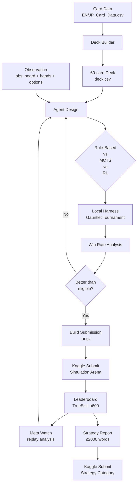

# Iteration Workflow

A structured workflow for developing, testing, and comparing AI agents for the
[Pokemon TCG AI Battle Challenge](https://www.kaggle.com/competitions/pokemon-tcg-ai-battle).

---

## Quick Start

```bash
make install          # dependencies + kaggle auth (one-time)
make download         # card reference data (one-time)
make sim-download     # simulation SDK (one-time — join both competitions first)

# Run your first experiment
mkdir -p workspace/exp001_baseline
# ... write agent.py and deck.csv ...
make gauntlet

# Compare experiments
ls workspace/results/*.json
```

---

## Visual Walkthrough



Each experiment is a self-contained directory under `workspace/expNNN_name/` with its own `agent.py`, `deck.csv`, and `SESSION_NOTES.md`.

---

## How It Works

### 1. Agent-driven experiments

Every experiment is a self-contained agent directory:

```
workspace/exp001_baseline/
  agent.py              # Agent subclass (RuleBasedAgent, MCTSAgent, etc.)
  deck.csv              # 60 Card IDs
  SESSION_NOTES.md      # Hypothesis, changes, results, takeaways
```

### 2. Local gauntlet testing

```bash
make gauntlet
```

Runs a round-robin tournament between all registered agents (random baseline + your experiments). Each pairing plays `n_matches` games with first/second player swapped.

```
workspace/results/
  gauntlet_results.json   # win-rate per agent
  exp001_vs_exp002.json   # head-to-head records
```

### 3. Live leaderboard tracking

Agents are rated via TrueSkill (μ/σ, μ₀=600). Only the **latest 2 submissions** count. This means:

- Submitting a worse agent can **displace** a better one from evaluation.
- Always test locally before pushing to Kaggle.
- Keep your best 2 agents in the sliding window.

### 4. Meta analysis

```bash
# Check what the top players are doing
# (manual: explore Kaggle leaderboard replays)
```

Understanding the current meta (what decks and strategies top players use) is
critical — the arena evolves weekly.

---

## Domain: Pokemon TCG Game State

The agent receives an observation dict at each decision point:

| Section | Key fields | What it provides |
|---|---|---|
| **Board** | `board` (active/bench pokemon, HP, status, energy) | Complete board state for both players |
| **Hand** | `hand` (cards in hand) | Known cards the agent holds |
| **Deck** | `deck` (remaining cards) | What's left to draw |
| **Prizes** | `prizes`, `prizes_left` | Win condition progress |
| **Options** | `options`, `minCount`, `maxCount` | Available actions (attack, retreat, play card, ability, etc.) |
| **Search** | `search_begin`, `search_step`, `search_end` | Forward lookahead API (predict opponent hidden info) |

**Key insight:** The observation includes both known info (your hand, public board state) and
game-engine search. An agent succeeds by making good decisions under uncertainty (opponent's
hand, draw order, coin flips) and by building a deck that covers common threats.

### Deck construction principles

- **60 cards exactly** (Kaggle enforces this, see `EN_Card_Data.csv` for valid IDs)
- Core consideration: consistency (Pokemon/trainer/energy ratio)
- Card data fields: HP, Type, Weakness, Resistance, Retreat cost, Move costs/damage/effects
- Deck must pass `make build-submit` validation

---

## Running the Baseline

```bash
make gauntlet  # uses registered agents; add yours to scripts/gauntlet.py
```

| Setting | Value |
|---|---|
| Baseline agent | RandomAgent (randomly picks valid actions) |
| Baseline deck | Placeholder (60x Card ID 1) |
| Engine | `cg` game engine from `data/sim_sample/cg/` |
| Matches per pair | 20 (doubled for both sides) |

---

## Iteration Log

*(No experiments have been run yet. Add entries here after each run using the format below.)*

### exp001 — Rule-based heuristic baseline

**Hypothesis:** Domain-specific heuristics (attack when lethal, retreat when threatened,
manage energy efficiently) should handily beat random play.

**Change:** Implemented a rule-based agent in `workspace/exp001_rule_based/agent.py`
subclassing `RuleBasedAgent` with:
- Attack priority: lethal check → damage max → energy acceleration → bench attack
- Retreat logic: retreat if active pokemon HP < 30 and bench has healthy alternative
- Energy: attach energy to active pokemon if it has an attack that matches
- Deck: simple consistent deck from `workspace/exp001_rule_based/deck.csv`

```
run:    exp001_rule_based
wr:     TBD  vs random
wr:     TBD  vs exp002
matches: TBD
```

**Takeaway:** TBD

---

### exp002 — Monte Carlo Tree Search

**Hypothesis:** MCTS with 100 simulations and opponent-model search (predict opponent
hidden info via `search_step`) should outperform rule-based heuristics by evaluating
multiple turns ahead.

**Change:** Implemented MCTS agent in `workspace/exp002_mcts/agent.py` using
`search_begin`/`search_step`/`search_end` for forward lookahead.  Same deck as exp001
to isolate search impact.

```bash
# Key MCTS params:
num_simulations: 100
exploration_constant: 1.4
max_search_depth: 10
```

```
run:    exp002_mcts
wr:     TBD  vs random
wr:     TBD  vs exp001
matches: TBD
time/decision: TBD ms
```

**Takeaway:** TBD

---

### exp003 — Deck optimization: counter-meta

**Hypothesis:** If the meta is dominated by a specific deck archetype (e.g., Dragapult ex),
building a counter-deck with type advantage and specific tech cards should outperform a
generic good-stuff deck.

**Change:** Analyzed top leaderboard replays → identified meta-dominant deck → built
counter deck in `workspace/exp003_counter/`.  Paired with exp001's heuristic agent.

```
run:    exp003_counter
wr:     TBD  vs exp001 (mirror heuristic, different deck)
matches: TBD
```

**Takeaway:** TBD

---

### exp004 — Utility-based action selection

**Hypothesis:** A utility function that scores each action based on board impact
(HP lead change, energy efficiency, tempo) should beat simple priority-ordering.

**Change:** Replaced priority-ordered heuristics with a utility scorer in
`workspace/exp004_utility/agent.py`.  Same deck as exp001.

```
run:    exp004_utility
wr:     TBD  vs exp001
matches: TBD
```

**Takeaway:** TBD

---

### exp005 — Exploit replay data (imitation learning)

**Hypothesis:** Learning from top-ranked player replays via imitation learning
(behavioral cloning) should capture high-level strategies that hand-crafted
heuristics miss.

**Change:** Collected top-10 agent replays, extracted (state, action) pairs, trained
a classifier to predict actions from observations.  Agent: learner + fallback to
exp001 heuristic on novel states.

```
run:    exp005_imitation
wr:     TBD  vs exp001
matches: TBD
```

**Takeaway:** TBD

---

### Template — New experiment (copy this)

```markdown
### expXXX — Brief description

**Hypothesis:** Why this should help — domain motivation or prior experimental insight.

**Change:** What was changed.  Agent at `workspace/expXXX_name/agent.py`,
deck at `workspace/expXXX_name/deck.csv`.

```python
# workspace/expXXX_name/agent.py
from pokemon.agent import RuleBasedAgent

class MyAgent(RuleBasedAgent):
    ...
```

```
run:    expXXX_name
wr:     TBD  vs random
wr:     TBD  vs exp001
matches: TBD
```

**Takeaway:** What we learned — keep going or dead end?
```

---

## Summary

| Experiment | Key idea | Win rate vs random | Win rate vs best prior | Decision time |
|---|---|---|---|---|
| exp001 | Rule-based heuristics | TBD | — | TBD |
| exp002 | MCTS | TBD | TBD | TBD |
| exp003 | Counter-meta deck | TBD | TBD | TBD |
| exp004 | Utility scorer | TBD | TBD | TBD |
| exp005 | Imitation learning | TBD | TBD | TBD |

*(Table fills in as experiments run.)*

---

## Workflow Reference

### Run a gauntlet (local tournament)

```bash
make gauntlet ARGS="--n-matches 50"
```

### Build a submission

```bash
make build-submit ARGS="--agent workspace/exp001_rule_based/agent.py --deck workspace/exp001_rule_based/deck.csv"
```

### Submit to Kaggle (Simulation)

```bash
make submit SUBMISSION_FILE=submit/submission.tar.gz SUBMISSION_MSG="exp001: rule-based heuristics"
```

### Create a new experiment

```bash
mkdir -p workspace/expXXX_name
cp workspace/exp001_rule_based/agent.py workspace/expXXX_name/agent.py
cp workspace/exp001_rule_based/deck.csv workspace/expXXX_name/deck.csv
# Edit agent.py and deck.csv, then test:
make gauntlet
```

---

## Next Directions

### Likely to help

- **Rule-based baseline** (exp001) — get a solid heuristic agent working before
  exploring complex approaches.  Simple rules (attack if lethal, retreat low HP,
  attach energy) should crush random.
- **MCTS with search API** (exp002) — the `search_begin`/`search_step`/`search_end`
  API is the most powerful tool available.  Monte Carlo Tree Search with opponent
  modeling can look multiple turns ahead.
- **Meta monitoring** — the arena evolves weekly.  Top players shift decks and
  strategies.  Analyze replays of top agents to identify their decks and decision
  patterns, then counter.
- **Deck engineering** — the right deck matters as much as the agent.  Test multiple
  deck archetypes with the same agent to isolate deck vs. strategy impact.
- **Eligible-pair management** — only the latest 2 submissions count.  Never submit
  without local verification.  Keep your best 2 agents in the sliding window.

### Worth trying

- **Opponent modeling** — predict opponent's hidden hand based on their observed
  actions.  Use Bayesian updating or learned priors from replay data.
- **Self-play reinforcement learning** — train vs earlier versions of your own agent.
  The RL sample code from Kaggle shows a starting point.
- **Deck dispatch** — use a classifier at game start to identify opponent's deck
  archetype (from card plays), then switch to a counter-strategy.
- **Action pruning** — MCTS is expensive.  Use a fast heuristic to prune the search
  tree to only promising branches before running simulations.
- **Phase-specific strategies** — early game (build board), mid game (take prizes),
  late game (prize race) require different priorities.

### Completed / dead ends

*(Populated as experiments run.)*

### Architecture notes

- The `Agent` ABC enforces the two-phase interface: deck selection (first call) and
  action selection (subsequent calls).  All agents share this contract.
- The `cg` game engine is a compiled `.so`/`.dll` with a Python ctypes wrapper.
  It's not pip-installable — it comes from the Kaggle Simulation competition data.
- The `search_begin`/`search_step`/`search_end` API is the key differentiator for
  this competition.  It lets agents simulate forward with predicted opponent
  hidden info — this is the foundation for MCTS, minimax, and belief-space search.
- `harness.py` wraps the engine for local testing.  It swaps first/second player to
  cancel positional bias, handles exceptions as forfeits, and logs per-match results.
- Experiments are self-contained directories — no config files, no training pipelines.
  Each experiment is a complete agent that can be tested, submitted, and iterated on.
- The Strategy Category writeup (≤2000 words) should document your experimental
  journey: hypotheses tested, dead ends, key insights, and the reasoning behind
  your final agent design.  Judge evaluation criteria: clarity, originality,
  stability, independence from luck.
