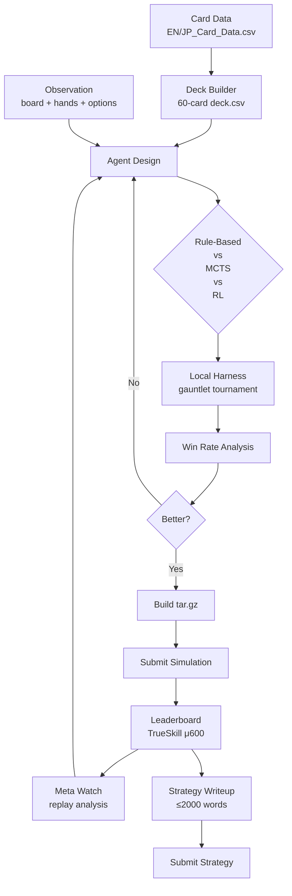

# kcom-pokemon

Kaggle Competition: [Pokemon TCG AI Battle Challenge](https://www.kaggle.com/competitions/pokemon-tcg-ai-battle) (Simulation) +
[Strategy](https://www.kaggle.com/competitions/pokemon-tcg-ai-battle-challenge-strategy)

Build an AI agent that plays the Pokemon Trading Card Game, then write a strategy report explaining your approach.

Two connected competitions:
- **Simulation** — submit a `.tar.gz` agent. Evaluated by win rate in the arena.
- **Strategy** — submit a ≤2000-word **writeup** explaining your agent's design. **$240,000 prize pool** (8 Finalists × $30,000). Evaluated by judges on clarity, originality, stability.

## Quick Start

```bash
make install          # uv sync + kaggle auth (one-time)
make download         # card reference data (one-time)
make sim-download     # simulation SDK (join both competitions first)
make test             # verify everything works
```

## Build and Submit

```bash
# 1. Create an agent + deck in workspace/
mkdir -p workspace/exp001_baseline
# ... write agent.py (subclass RuleBasedAgent) and deck.csv (60 Card IDs)

# 2. Test locally
make gauntlet

# 3. Package for Kaggle
make build-submit ARGS="--agent workspace/exp001_baseline/agent.py --deck workspace/exp001_baseline/deck.csv"

# 4. Submit to the arena
make submit SUBMISSION_FILE=submit/submission.tar.gz SUBMISSION_MSG="exp001: rule-based baseline"

# 5. Write the strategy report (≤2000 words)
# Submit at: https://www.kaggle.com/competitions/pokemon-tcg-ai-battle-challenge-strategy
```

See **[Iteration.md](Iteration.md)** for the full experiment log, suggested experiments, and workflow reference.

## Pipeline



- **Agent interface** — `agent(obs_dict) -> list[int]`. First call returns a 60-card deck, subsequent calls return action indices.
- **Game engine** — `cabt Engine` via `cg` package (compiled `.so`/`.dll`, ctypes wrapper). Downloaded via `make sim-download`.
- **Search API** — `search_begin`/`search_step`/`search_end` for forward lookahead (MCTS, alpha-beta).
- **Rating** — TrueSkill μ/σ (μ₀=600), win/loss only, latest 2 submissions evaluated.

## Agent Architecture

```python
from pokemon.agent import RuleBasedAgent

class MyAgent(RuleBasedAgent):
    def __init__(self, deck, random_seed=42):
        super().__init__(deck=deck, random_seed=random_seed)

    def _act(self, obs: dict) -> list[int]:
        # obs["options"] — available action indices
        # obs["minCount"], obs["maxCount"] — how many to pick
        # obs["board"], obs["hand"], obs["deck"] — full game state
        return [obs["options"][0]]  # Replace with your logic
```

See `AGENTS.md` for the full agent interface spec, observation schema, and gotchas.

## Kaggle API Setup

```bash
# Option A: environment variable
export KAGGLE_API_TOKEN=KGAT_<your-token>

# Option B: token file
echo -n "KGAT_<your-token>" > .kaggle/access_token
chmod 600 .kaggle/access_token
```

You must **join both competitions** (Accept Rules) on Kaggle before `make download` and `make sim-download` work:
- [Simulation](https://www.kaggle.com/competitions/pokemon-tcg-ai-battle)
- [Strategy](https://www.kaggle.com/competitions/pokemon-tcg-ai-battle-challenge-strategy)

## Development

```bash
make lint           # ruff check
make format         # ruff format --check
make format-fix     # apply formatting
make test           # pytest (mock observations, no engine needed)
make gauntlet       # local agent tournament (requires SDK)
```

## Repository Structure

```
src/pokemon/               # Core package
  agent.py                 # Agent ABC + RandomAgent + RuleBasedAgent
  deck.py                  # 60-card deck builder + CSV I/O
  data.py                  # Card data loader
  harness.py               # Local match runner + gauntlet
  tracking.py              # Experiment logger
config/
  agent.yaml               # Agent config template
workspace/
  expNNN_name/             # Experiment directories
    agent.py               # Your agent subclass
    deck.csv               # 60 Card IDs
    SESSION_NOTES.md       # Hypothesis, results, takeaways
scripts/
  gauntlet.py              # Tournament runner
  build_submission.py      # Package agent for Kaggle
tests/
  test_agent.py            # Agent interface tests
  test_deck.py             # Deck builder tests
  test_integration.py      # E2E pipeline tests
data/
  raw/                     # Card reference CSVs (EN/JP_Card_Data)
  sim_sample/              # Simulation SDK (cg engine)
submit/                    # Built submission tarballs
```
