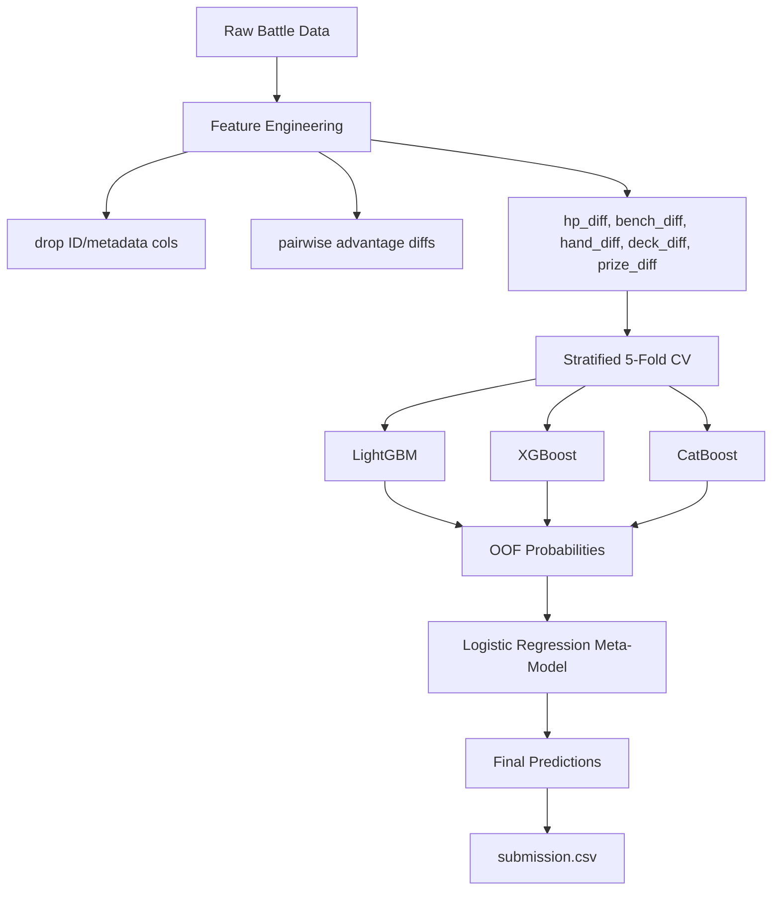

# kcom-pokemon

Kaggle Competition: [Pokemon TCG AI Battle Challenge Strategy](https://www.kaggle.com/competitions/pokemon-tcg-ai-battle-challenge-strategy)

Predict the outcome of Pokémon Trading Card Game battles from in-game state features (HP, bench size, hand/deck counts, prize progress, deck archetypes).

**Evaluation Metric:** Accuracy  
**Target column:** `winner`

## Happy Path — One Command

```bash
# Requires Kaggle API token (see setup below)
make all
```

This single command runs the entire pipeline:

```mermaid
graph LR
    A[make all] --> B[make install]
    B --> C[uv sync + auth]
    C --> D[make download]
    D --> E[fetch data from Kaggle]
    E --> F[make train]
    F --> G[train 5-fold ensemble]
    G --> H[save submission.csv]
    H --> I[make submit]
    I --> J[upload to Kaggle]
    J --> K[show leaderboard]
```



## Kaggle API Setup

```bash
# Option A: Set environment variable
export KAGGLE_API_TOKEN=KGAT_<your-token>

# Option B: Write token to file
echo -n "KGAT_<your-token>" > .kaggle/access_token
chmod 600 .kaggle/access_token

# Get your token at: https://www.kaggle.com/settings -> API -> Create New Token
```

## Detailed Step-by-Step

```bash
# 1. Install dependencies + authenticate
make install

# 2. Download competition data
make download

# 3. Train ensemble & generate submission
make train

# 4. Submit to leaderboard
make submit

# 5. Run tests
make test
```

## Custom Submission

```bash
# Submit a different file with custom message
make submit SUBMISSION_FILE=outputs/submissions/experiment_v2.csv SUBMISSION_MSG="v2: label encoding + prize_diff interaction"
```

## Development

```bash
make lint      # ruff check
make format    # ruff format (check only)
make test      # pytest
make submit    # submit to Kaggle leaderboard
```

## Repository Structure

```
├── config/config.yaml          # Experiment configuration
├── data/                       # Train/test CSVs (download with make download)
├── src/pokemon/                # Python package
│   ├── data.py                 # Data loading & preprocessing
│   ├── features.py             # Feature engineering (diffs, interactions, encoding)
│   ├── models.py               # LGBM + XGB + CatBoost + stacking ensemble
│   └── tracking.py             # Experiment run logger
├── scripts/
│   ├── train.py                # End-to-end training pipeline
│   ├── predict.py              # Inference & submission generation
│   └── compare.py              # Compare experiment runs
├── tests/
│   ├── test_models.py          # Unit tests
│   └── test_integration.py     # Integration tests (synthetic data)
├── outputs/submissions/        # Generated submission CSVs
├── Makefile                    # Automation targets
└── pyproject.toml              # Project & dependency config (uv sync)
```

## Pipeline Architecture



## Approach

1. **Feature Engineering** — Drop ID/metadata, compute player-vs-opponent advantage diffs (HP, bench size, hand count, deck count, prizes taken), one-hot encode deck and Pokémon names.
2. **Base Models** — LightGBM, XGBoost, CatBoost trained with stratified 5-fold cross-validation.
3. **Stacking** — Logistic Regression meta-model on out-of-fold probability predictions.
4. **Evaluation** — Accuracy (competition metric).
